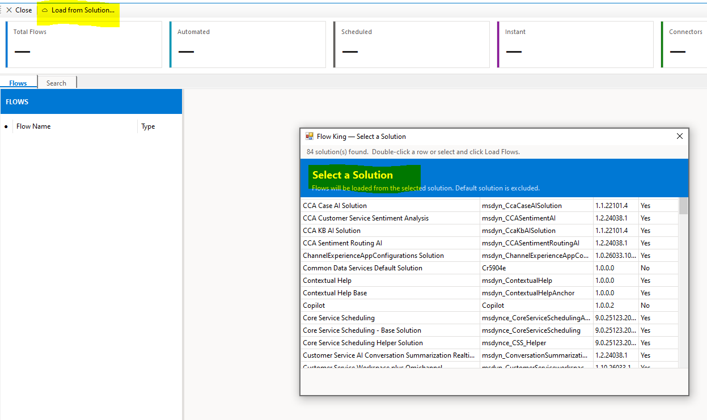
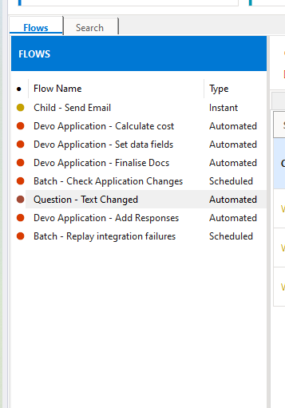
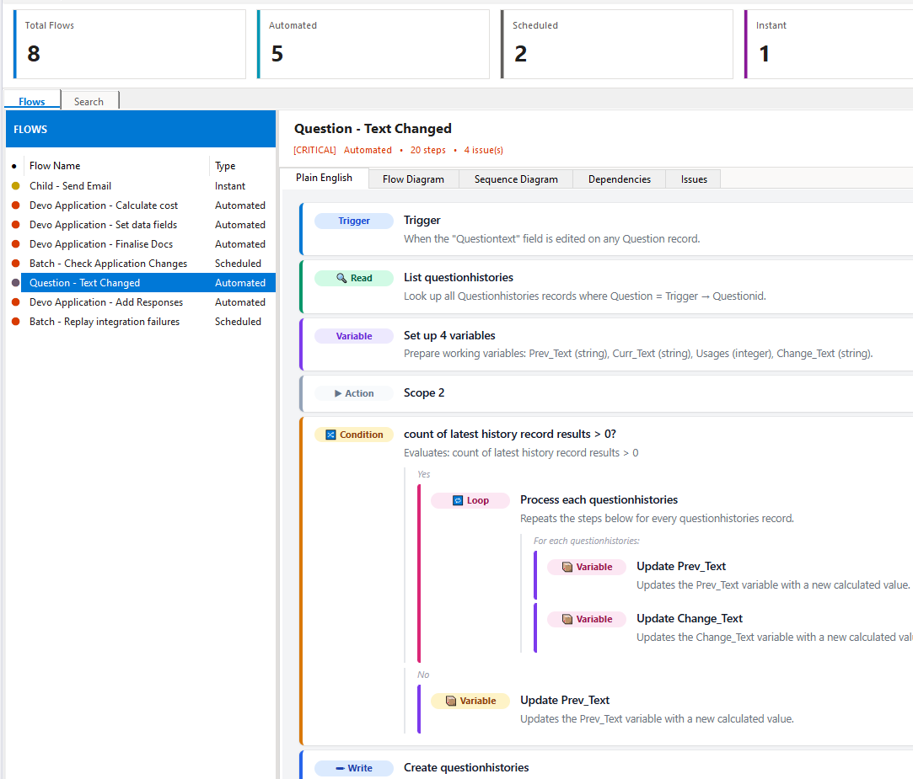
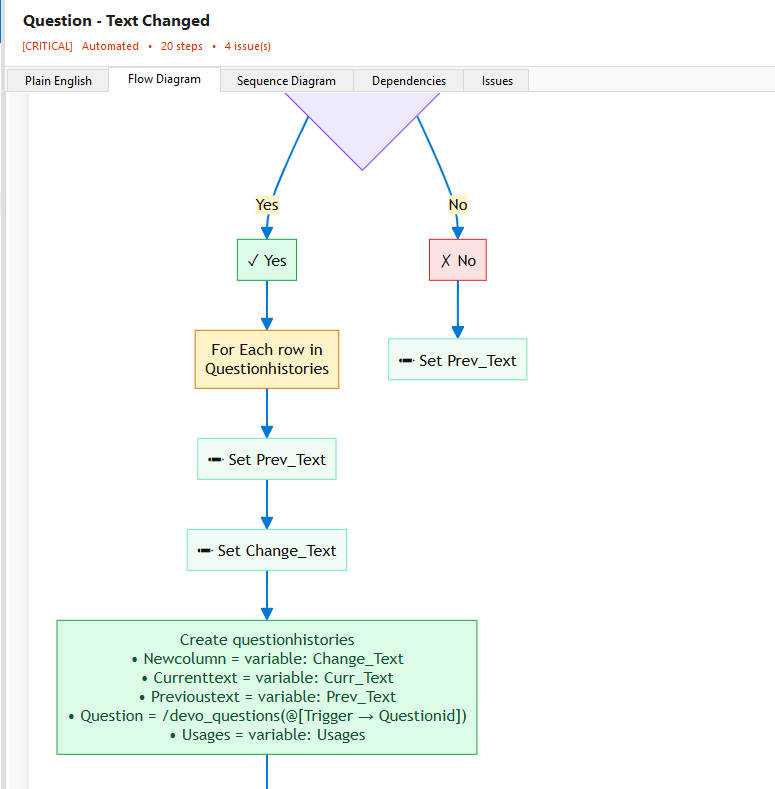
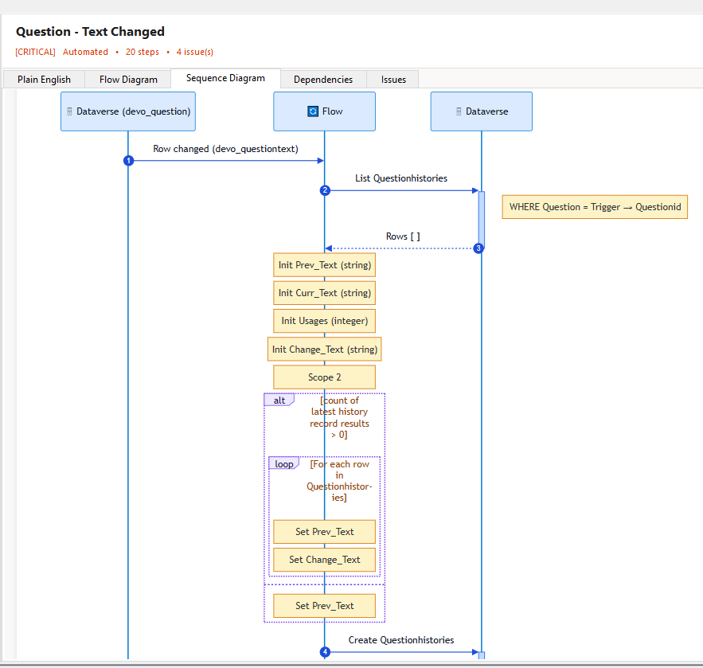
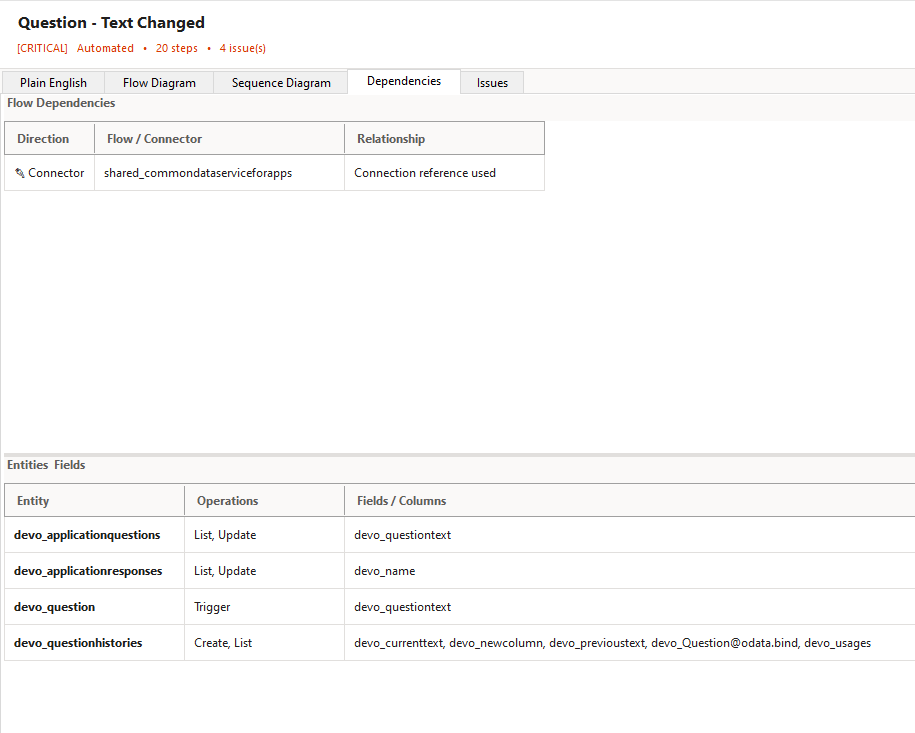
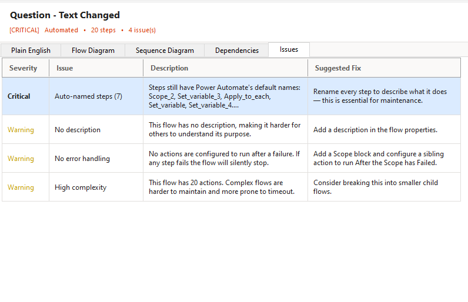
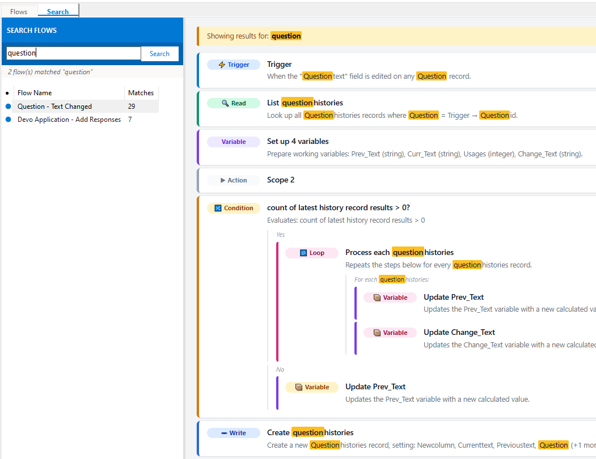

# Flow King — Feature Overview

**Flow King** is an XrmToolBox plugin that gives Dynamics 365 / Power Platform developers an instant, visual understanding of the Power Automate flows inside a solution. Instead of opening each flow one by one in the Power Automate designer, Flow King loads them all at once and surfaces the big picture — what they do, what they touch, and what might be wrong.

---

## Page 1 — Getting Started & The Flows View

### Connecting and Loading Flows

1. Open XrmToolBox and connect to your Dataverse environment.
2. Open **Flow King** from the tool list.
3. Click **☁ Load from Solution…** in the toolbar.
4. Select a solution from the picker — Flow King loads and parses every modern Power Automate flow in that solution.

> *Screenshot — Solution picker dialog*

---

### Solution Summary Tiles

At the top of the screen, six stat tiles give an instant health snapshot of the loaded solution:

| Tile | What it shows |
|---|---|
| **Total Flows** | Count of all flows loaded from the solution |
| **Automated** | Flows triggered by a Dataverse event (row created / updated / deleted) |
| **Scheduled** | Flows on a recurring timer |
| **Instant** | Manually triggered flows (button / Power App / child flow) |
| **Connectors** | Distinct connection references used across all flows |
| **Issues Found** | Total health warnings and critical issues detected |

---

### Flow List

The left panel lists every flow with a colour-coded health indicator:

- 🟢 **Healthy** — no issues detected
- 🟡 **Warning** — potential improvements found
- 🔴 **Critical** — problems that should be fixed before go-live

Each row shows the flow name, trigger type, and total action count. Clicking a row loads the full detail view on the right.

> *Screenshot — Flow list with health icons*

---

### Plain English View

The default detail tab translates the flow's internal JSON into readable, colour-coded action cards — no Power Automate designer required.

Each card shows:
- A **pill label** (Trigger / Read / Write / Condition / Loop / Variable / Child Flow)
- A plain-English **title** describing what the step does
- A **description** with filter conditions, field names, and entity targets

Nested branches (Yes/No paths, loop bodies) are indented inline so the full logic is visible without scrolling between tabs.

> *Screenshot  — Plain English cards for a multi-step flow*

---

### Flow Diagram

The **Flow Diagram** tab renders an interactive flowchart using Mermaid, showing every action as a node with directional arrows representing the execution path.

- **Blue** — trigger / entry point
- **Green** — create operations
- **Sky blue** — read / list operations
- **Orange** — conditions (diamond shape)
- **Pink** — loops
- **Purple** — child flow calls

> *Screenshot  — Flowchart for an automated flow*

---

### Sequence Diagram

The **Sequence Diagram** tab shows the same flow as a participant timeline — ideal for understanding the back-and-forth between the Flow, Dataverse, and any callers or child flows.

Numbered sequence steps make it easy to walk through the flow in order during a code review or handover session.

> *Screenshot — Sequence diagram with Dataverse and caller participants*

---

## Page 2 — Analysis Tabs, Search & Health

### Dependencies & Entities

The **Dependencies** tab is split into two sections:

**Flow Dependencies** (top half)

Shows all relationships this flow has with other flows and connectors:

| Direction | Meaning |
|---|---|
| ⬆ Caller | Another flow in the solution calls this one as a child |
| ⬇ Calls | This flow invokes another flow as a child |
| 🔌 Connector | A connection reference used by this flow |

This makes it straightforward to answer: *"If I change this flow, what else is affected?"*

**Entities & Fields** (bottom half)

A parsed breakdown of every Dataverse table this flow touches, the operations performed, and the specific columns read or written:

| Column | What it shows |
|---|---|
| **Entity** | Dataverse table logical name |
| **Operations** | Trigger / Get / List / Create / Update / Upsert / Delete |
| **Fields / Columns** | Fields from `$select` (reads) and `item/` parameters (writes) |

This is the fastest way to answer: *"What tables does this flow touch?"* and *"Which fields are being written?"*

> *Screenshot — Dependencies and Entities & Fields split view*

---

### Issues & Health Checks

The **Issues** tab runs automated health checks against every flow and flags problems with a severity rating:

| Severity | Examples |
|---|---|
| 🔴 **Critical** | No error handling, nested Apply-to-each inside Apply-to-each, missing trigger conditions |
| 🟡 **Warning** | No flow description, hardcoded values in action inputs, `$top=1` query used in a loop |
| 🟢 **Healthy** | No issues detected — flow passed all checks |

Each issue includes a **Title**, **Description**, and **Suggested Fix** so developers know exactly what to change.

> *Screenshot  — Issues grid showing critical and warning rows*

---

### Search

The **Search** tab lets developers find any term — a field name, entity name, email address, expression keyword, or connector — across all flows in the solution simultaneously.

Results show:
- Which flows match
- How many times the term appears in each flow
- A highlighted Plain English view of the matching flow with every occurrence marked in yellow

This is particularly useful when answering questions like: *"Which flows reference the `devo_status` field?"* or *"Does any flow send email to this address?"*

> *Screenshot  — Search results with highlighted matches*

---

### Toolbar

| Button | Action |
|---|---|
| **✕ Close** | Closes the Flow King tool tab |
| **☁ Load from Solution…** | Opens the solution picker and loads flows from the selected solution |

The toolbar also displays the **author section** on the right side, linking to the developer's LinkedIn profile.

---

## Requirements

- XrmToolBox (latest)
- .NET Framework 4.8
- Microsoft Edge WebView2 Runtime (for diagram and search views)
- A Dataverse / Dynamics 365 connection configured in XrmToolBox

## v1.0.5

### By Entity tab — redesigned
- Left panel now lists **entities** instead of flows
- Trigger entities (those that fire an Automated flow) are shown first with a ⚡ indicator, sorted A–Z; used-only entities follow
- Selecting an entity shows two tables on the right:
  - **Triggered Flows** — Automated flows that fire when this entity changes
  - **Flows That Use This Entity** — all flows that read, create, update, or delete records of this type, with the operations and fields listed

### Child Flows tab
- New tab showing only flows that are called as child flows by other flows in the loaded solution
- Selecting a child flow shows the full list of parent flows that call it, with their trigger type

### Flow step display improvements
- Step names no longer end with a trailing `?` (affected condition steps and some field-derived names)
- "Call child flow" steps now show the actual child flow name instead of the internal action name
- Single `Compose`, `Set Variable`, and standalone `Initialize Variable` steps are hidden from all views — they are implementation noise. Back-to-back variable initialisation groups are still shown
- Single-word steps with no description (e.g. `Scope`, `Switch`) are suppressed from the Plain English, Diagram, and Sequence views

---

*Flow King — built for Power Platform developers who need the big picture fast.*
